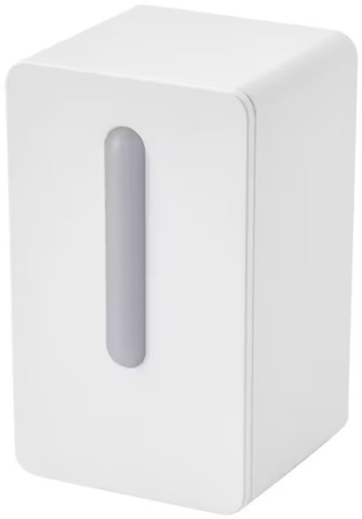
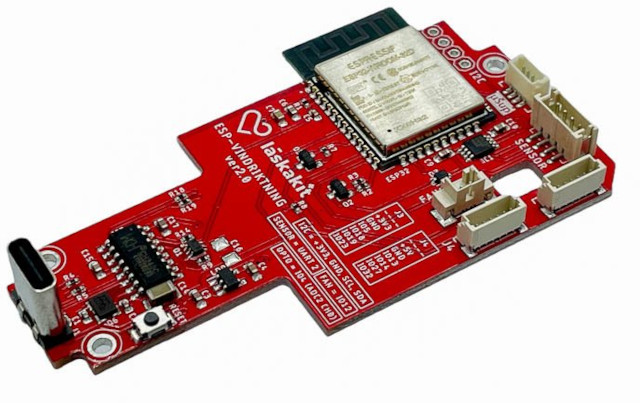
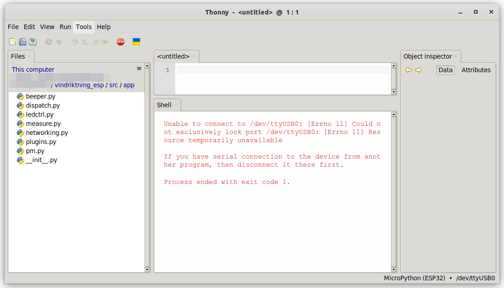
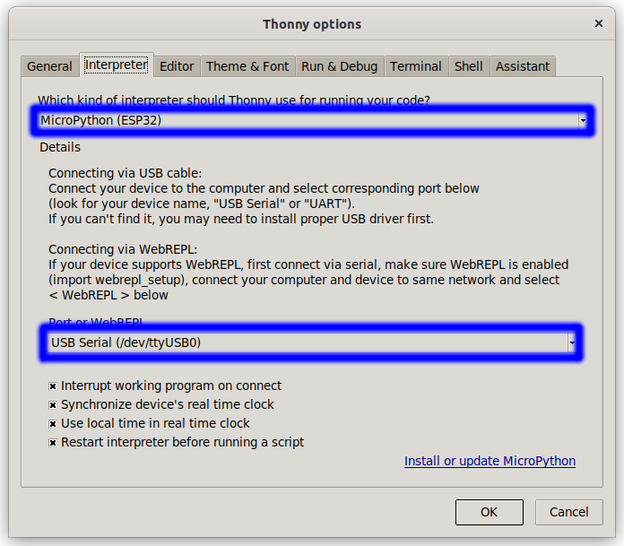
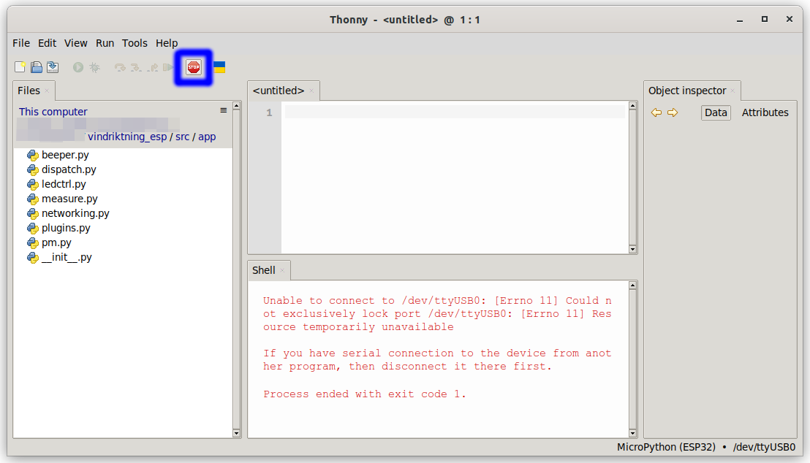
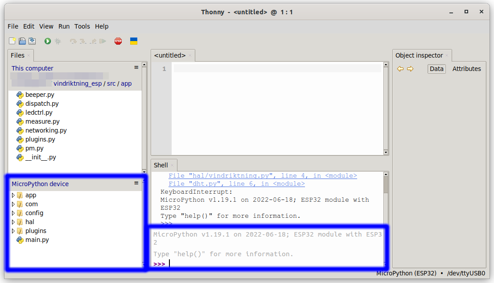
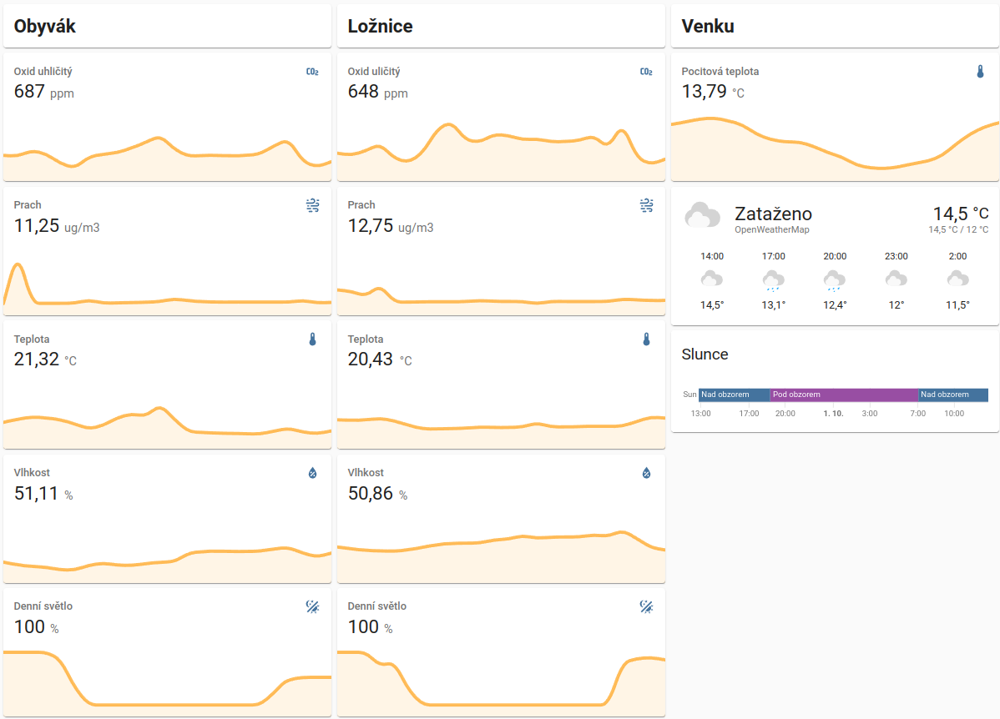

# VINDRIKTNING ESP32

## About this project

This project takes [Ikea VINDRIKTNING air dust sensor](https://www.ikea.com/de/de/p/vindriktning-luftqualitaetssensor-70498242/)
in combination with [LaskaKit ESP-VINDRIKTNING ESP-32 I2C](https://github.com/LaskaKit/ESP-Vindriktning), adds
several sensors such as [SCD41](https://www.laskakit.cz/laskakit-scd41-senzor-co2--teploty-a-vlhkosti-vzduchu/) and
[DHT22 (optional)](https://www.laskakit.cz/arduino-senzor-teploty-a-vlhkosti-vzduchu-dht22/) for full measuring of air quality.

 

## Hardware

Used hardware is mentioned above. This combination of HW sensors allows to measure following parameters:

- Amount of C02 in ppm in the air (by `SCD41`)
- Amount of dust in ug/m3 in the air (by `PM1006K`)
- Air temperature (by `SCD41` or `DHT22`)
- Air humidity (by `SCD41` or `DHT22`)
- Ambient light amount (by internal phototransistor)

As an output the 3 RGB led diodes are used. Also [buzzer](https://www.laskakit.cz/akusticky-bzucak--modul/) can be attached
to alert you when air quality getting low and your room needs to be ventilated. 

You can see wiring of external sensors here:

```
                         (optional)
   ++==========++       ++=========++
   ||          ||       ||         ||
   ||  -----   ||       ||  -----  ||
   ||  SCD41   ||       ||  DHT22  ||
   ||  -----   ||       ||  -----  ||
   ||          ||       ||         ||
   || SCL  SDA ||       ||  DATA   ||
   ++==o====o==++       ++===o=====++
       |    |                |
       |    |(uSup)          |(J3)
   ++==o====o================o=====++
   || IO22 IO21             IO5    ||
   ||                              ||
   ||      ------------------      ||
   ||      VINDRIKTNING-ESP32      ||
   ||      ------------------      ||
   ||                              ||
   ||    IO13          IO12  UART2 ||
   ++=====o=============o=====oo===++
          |(J4)         |     ||
          |             |     ||
   ++=====o====++   ++==o=====oo===++
   ||          ||   || FAN   RX/TX ||
   ||          ||   ||             ||
   ||  ------  ||   ||   -------   ||
   ||  Buzzer  ||   ||   PM1006K   ||
   ||  ------  ||   ||   -------   ||
   ||          ||   ||             ||
   ++==========++   ++=============++
```

## Software

As base software platform have been used [Micropython](https://micropython.org/), as it is relatively robust, lean and
easy to develop. It also allow to easily adds custom plugins in the case of need. Whole system is written using asyncio
based cooperative scheduling. This concept allows following:

- Written software based on asyncio cooperative scheduling
- Simple plugins framework
- Access to sensors and dispatching it's values to plugins
- Easy configuration based on configuration scripts
- Power management handling
- Automatic LED intensity based on surrounding light amount and and color transition control
- Access to WiFi networking

By default there are following preprogrammed plugins:

- `sensor_to_led` used to set LED diodes according to current sensors state (CO2 and dust)
- `sensor_to_mqtt` used to send sensors values to [MQTT](https://mqtt.org/) broker so they can be later processed e.g. by [Home Assistant](https://www.home-assistant.io/) or another MQTT client.
- `co2_alert` alerts you when CO2 amount in room reaches above certain limit

### Micropython

#### Install

1. Download and install [python](https://www.python.org/)
2. Install [esptool](https://github.com/espressif/esptool) by command `pip install esptool`
3. Download [Micropython firmware](https://micropython.org/resources/firmware/esp32-20220618-v1.19.1.bin) for [ESP32](https://micropython.org/download/esp32/) (or use [one from repository](mpy/fw/esp32-20220618-v1.19.1.bin))
4. Erase chip by following command `esptool.py --chip esp32 --port /dev/ttyUSB0 erase_flash` (choose port where your device is connected - `COM`*n* on Windows)
5. Flash downloaded firmware by command `esptool.py --chip esp32 --port /dev/ttyUSB0 --baud 460800 write_flash -z 0x1000 esp32-20220618-v1.19.1.bin`

When all steps above succeeded, you shall be able to see python repl interactive terminal on UART:

```
MicroPython v1.19.1-esp32 on 2022-09-18; ESP32-WROVER with ESP32
Type "help()" for more information.
>>> 
```

#### Additional tweaking

For additional tweaking we needs some UART terminal. We can use [Thonny IDE](https://thonny.org/) for this purposes.
To install this IDE we can use command `pip install thonny`. After that you can type `thonny` in your terminal and
run it.



First of all we need to set-up IDE to be attached to micropython device. To do that go into
`Tools -> Options... -> Interpreter` and choose `Micropython (ESP32)` and port where is ESP connected.



Once interpreter is set up, then click on `Stop/Start backend` button (or press `CTRL` + `F2`).



Then you can be able to see python repl prompt and files stored in device.



By default `FAT` file system is created on `ESP32` chip, however I would suggest to format internal file system to `littlefs`.
There are two main reasons why to do that:

1. `littlefs` is way faster in accessing files then `FAT`. This speeds up reading and executing scripts.
2. `littlefs` is designed to work on FLASH and does not drain it so much by amount of writes as `FAT` does.

Formating to `littlefs` described [here](https://docs.micropython.org/en/latest/reference/filesystem.html#littlefs)
can be done by following commands in python repl terminal:

```
import os
os.umount('/')
os.VfsLfs2.mkfs(bdev)
os.mount(bdev, '/')
```

#### Upload scripts

Once we have file system prepared we can use [thonny](https://thonny.org/) to upload all scripts from `src` folders
to `Micropython device` (all `*.py` files including folders structure).

Then just restart device and scripts will be started automatically when device boots (entry point is `main.py`).
Device shall show CO2 and dust sensor state on LED with default configuration and shall be able to play beeping
when CO2 raises above certain level (low quality of air).

### Configuration

All configuration scripts are located in `config` folder. There are several general configuration scripts:

#### `config/sys.py`

- `pm_enabled` - When set to true, then power management module is activated. This module is sending processor to
  light sleep mode time after time to reduce processor heating. This is required especially by `SCD41` sensor
  which needs to be protected from outer heat as much as possible to get reliable measuring.

- `wdt_time` - Watchdog time. When system is inactive for this time (power management task is not woken up)
  then processor is restarted.

#### `config/wifi.py`

- `ssid` - SSID of WiFi network to be connected if requested by plugin
- `passwd` - Password to connect to WiFi if requested by plugin

### Plugins

Software is written to support core user functionality by plugins. This plugins are loaded automatically from folder
`plugins`. Each plugin has its own configuration file stored in `config/plugins` (python script with the same name
as plugin). Configuration script for each plugin contains various configuration items, however each of them contains
boolean variable `enabled` which is used to enable/disable plugin loading.

There are several plugins already present po provide some basic functionality or as some examples for those who wants
to write his own.

#### `sensor_to_led`

This plugin handles LED colors according to sensors values. Especially CO2 (top LED) and dust (bottom LED) sensor.
Colors are signalizing smoothly from green (good conditions), over blue (normal conditions) to red (bad conditions).


Configuration contains following elements:

- `levels_co2` - Tuple containing levels for good, medium, bad and worst level to be displayed.
- `levels_dust` - The same as `levels_co2` for dust.
- `night_mode` - When mode is set on `True`, then there will be no any back-light except red during night

#### `sensor_to_mqtt`

This plugin provides sensors data to MQTT broker so anyone can use them. When plugin starts, it prints
on UART template of settings for [Home Assistant](https://www.home-assistant.io/) so you can see them
as regular sensors. Just note that this template is printed in debug mode only
(see chapter [config/sys.py](#config/sys.py)).

```
   [sensor_to_mqtt] 
   [sensor_to_mqtt] When you want to see you sensors in Home Assistant, please add following to configuration.yaml
   [sensor_to_mqtt] 
   [sensor_to_mqtt] mqtt:
   [sensor_to_mqtt]   sensor:
   [sensor_to_mqtt]     - name: "My own CO2 sensor name (please fill in)"
   [sensor_to_mqtt]       unique_id: "vindriktning_livingroom_co2"
   [sensor_to_mqtt]       icon: "mdi:molecule-co2"
   [sensor_to_mqtt]       state_topic: "vindriktning/livingroom"
   [sensor_to_mqtt]       unit_of_measurement: "ppm"
   [sensor_to_mqtt]       value_template: "{{ value_json.co2 }}"
   [sensor_to_mqtt]     - name: "My own dust sensor name (please fill in)"
   [sensor_to_mqtt]       unique_id: "vindriktning_livingroom_dust"
   [sensor_to_mqtt]       icon: "mdi:weather-dust"
   [sensor_to_mqtt]       state_topic: "vindriktning/livingroom"
   [sensor_to_mqtt]       unit_of_measurement: "ug/m3"
   [sensor_to_mqtt]       value_template: "{{ value_json.dust }}"
   [sensor_to_mqtt]     - name: "My own temperature sensor name (please fill in)"
   [sensor_to_mqtt]       unique_id: "vindriktning_livingroom_temp"
   [sensor_to_mqtt]       icon: "mdi:thermometer"
   [sensor_to_mqtt]       state_topic: "vindriktning/livingroom"
   [sensor_to_mqtt]       unit_of_measurement: "°C"
   [sensor_to_mqtt]       value_template: "{{ value_json.temp }}"
   [sensor_to_mqtt]     - name: "My own temperature sensor name (please fill in)"
   [sensor_to_mqtt]       unique_id: "vindriktning_livingroom_humi"
   [sensor_to_mqtt]       icon: "mdi:water-percent"
   [sensor_to_mqtt]       state_topic: "vindriktning/livingroom"
   [sensor_to_mqtt]       unit_of_measurement: "%"
   [sensor_to_mqtt]       value_template: "{{ value_json.humi }}"
   [sensor_to_mqtt]     - name: "My own light sensor name (please fill in)"
   [sensor_to_mqtt]       unique_id: "vindriktning_livingroom_light"
   [sensor_to_mqtt]       icon: "mdi:theme-light-dark"
   [sensor_to_mqtt]       state_topic: "vindriktning/livingroom"
   [sensor_to_mqtt]       unit_of_measurement: "%"
   [sensor_to_mqtt]       value_template: "{{ value_json.light }}"
   [sensor_to_mqtt] 

```



- `server` - IP address of MQTT broker.
- `port` - Listening port of MQTT broker.
- `user` - MQTT broker login user name.
- `password` - MQTT user login password.
- `ssl` - When set to True then SSL/TLS connection is used (without certificates check).
- `topic` - Topic representing this sensor on MQTT broker.
- `period` - Period in which new data will be sent to MQTT broker.
- `retry_time` - Time after which plugin will retry to connect if connection was not succesful. 

#### `co2_alert`

This plugin activates alarm on built in buzzer when CO2 level exceedes certain value to notify
that is time to open window and make air more fresh.

- `levels_high` - Alert is activated when CO2 raises over this level.
- `levels_low` - No next alert will be raised till amount of CO2 drops bellow this level (hysteresis principle).
- `night_silent` - Don't alert during the night.

### Advices

#### Measuring with `SCD41`

Sensor `SCD41` does great job and measures relatively precisely. But this is true only in certain conditions.
Output of this sensor depends on how this sensor is mounted into the device. Measurement can be negatively
affected by external vibration or heating or cooling. This can be in small space like VINDRIKTNING box especialy
when ESP32 chip produces some heat and when area is even ventilated by `PM1006K` a bit problem. This is main reason
why some kind of power management was implemented in this software. However to add additional molytan isolation
around sensor would help. Be sure to keep side of sensor pointing out of the box uncovered to keep access to the
outer air. To use some rubber mount dumpers would be good idea as well as there may be vibrations from `PM1006K`
ventilator.

#### Measuring with `DHT21`

I tried to add also `DHT21` as I was unsure about precision of measuring humidity and temperature by `SCD41`.
However after some time I found that `SCD41` gets values reliable enough, so to use `DHT21` is not necessary.

